## Overview

The `vst()` function applies variance stabilizing transformation to UMI count data using a regularized Negative Binomial regression model. This removes unwanted effects from UMI data and returns Pearson residuals.

The original scripts have overly complex logic flow.

{}
This blog is composed to easily trace specific parameters by using 'CTRL+F'.
{}

## Function Signature with Real Defaults

```r
vst <- function(umi,
                cell_attr = NULL,
                latent_var = c('log_umi'),             # DEFAULT
                batch_var = NULL,                      # DEFAULT
                latent_var_nonreg = NULL,              # DEFAULT
                n_genes = 2000,                        # DEFAULT
                n_cells = NULL,                        # DEFAULT
                method = 'poisson',                    # DEFAULT
                do_regularize = TRUE,                  # DEFAULT
                theta_regularization = 'od_factor',    # DEFAULT
                res_clip_range = c(-sqrt(ncol(umi)), sqrt(ncol(umi))), # DYNAMIC
                bin_size = 500,                        # DEFAULT
                min_cells = 5,                         # DEFAULT
                residual_type = 'pearson',             # DEFAULT
                return_cell_attr = FALSE,              # DEFAULT
                return_gene_attr = TRUE,               # DEFAULT
                return_corrected_umi = FALSE,          # DEFAULT
                min_variance = -Inf,                   # DEFAULT
                bw_adjust = 3,                         # DEFAULT
                gmean_eps = 1,                         # DEFAULT
                theta_estimation_fun = 'theta.ml',     # DEFAULT
                theta_given = NULL,                    # DEFAULT
                exclude_poisson = FALSE,               # DEFAULT
                use_geometric_mean = TRUE,             # DEFAULT
                use_geometric_mean_offset = FALSE,     # DEFAULT
                fix_intercept = FALSE,                 # DEFAULT
                fix_slope = FALSE,                     # DEFAULT
                scale_factor = NA,                     # DEFAULT
                vst.flavor = NULL,                     # DEFAULT
                verbosity = 2,                         # DEFAULT
                verbose = NULL,                        # DEPRECATED
                show_progress = NULL)                  # DEPRECATED
```


## Parameters

### Core Parameters

| Parameter | Type | Default | Description |
|-----------|------|---------|-------------|
| `umi` | matrix | **required** | Matrix of UMI counts with genes as rows and cells as columns |
| `cell_attr` | data.frame | `NULL` | Data frame containing dependent variables; auto-generated if omitted |
| `latent_var` | character | `c("log_umi")` | Independent variables to regress out; must match `cell_attr` column names |
| `batch_var` | character | `NULL` | Variables indicating batch membership; no batch terms if omitted |
| `latent_var_nonreg` | character | `NULL` | Non-regularized dependent variables to regress out |

### Model Configuration

| Parameter | Type | Default | Description |
|-----------|------|---------|-------------|
| `n_genes` | numeric | `2000` | Number of genes for parameter estimation; `NULL` uses all genes |
| `n_cells` | numeric | `NULL` | Number of cells for parameter estimation; `NULL` uses all cells |
| `method` | character | `"poisson"` | Parameter estimation method (see Methods section) |
| `do_regularize` | logical | `TRUE` | Whether to perform parameter regularization |
| `theta_regularization` | character | `"od_factor"` | Theta regularization method; `"log_theta"` for pre-v0.3 behavior |

### Processing Options

| Parameter | Type | Default | Description |
|-----------|------|---------|-------------|
| `res_clip_range` | numeric | `c(-√n_cells, √n_cells)` | Min/max clipping values for results |
| `bin_size` | numeric | `500` | Genes processed simultaneously (affects memory/progress) |
| `min_cells` | numeric | `5` | Minimum cells for gene detection |
| `residual_type` | character | `"pearson"` | Residual type: `"pearson"`, `"deviance"`, or `"none"` |

### Output Control

| Parameter | Type | Default | Description |
|-----------|------|---------|-------------|
| `return_cell_attr` | logical | `FALSE` | Include cell attributes in output |
| `return_gene_attr` | logical | `TRUE` | Calculate and include gene attributes |
| `return_corrected_umi` | logical | `FALSE` | Include corrected UMI matrix |
| `verbosity` | integer | `2` | Verbosity level: 0 (silent), 1 (messages), 2 (messages + progress) |

### Advanced Parameters

| Parameter | Type | Default | Description |
|-----------|------|---------|-------------|
| `min_variance` | character/numeric | `-Inf` | Lower bound for variance estimation |
| `bw_adjust` | numeric | `3` | Kernel bandwidth adjustment for regularization |
| `gmean_eps` | numeric | `1` | Small value added for geometric mean calculation |
| `theta_estimation_fun` | character | `"theta.ml"` | Theta estimation method |
| `theta_given` | numeric | `NULL` | Fixed theta values (method-dependent) |
| `exclude_poisson` | logical | `FALSE` | Exclude Poisson genes from regularization |
| `use_geometric_mean` | logical | `TRUE` | Use geometric mean for calculations |
| `vst.flavor` | character | `NULL` | Use `"v2"` for updated model parameters |

## Methods

The `method` parameter supports several estimation approaches:

### Standard Methods
- **`"poisson"`** (default): Poisson regression with theta estimation via residuals
- **`"qpoisson"`**: Quasi-Poisson regression (fastest, similar to glmGamPoi)
- **`"nb_fast"`**: Fast negative binomial with coefficient re-estimation
- **`"nb"`**: Full negative binomial via `MASS::glm.nb`
- **`"glmGamPoi"`**: Estimation via `glmGamPoi::glm_gp`

### Offset Methods
- **`"offset"`**: Fixed offset model with no learned regression parameters
- **`"offset_shared_theta_estimate"`**: Shared theta estimation across genes
- **`"glmGamPoi_offset"`**: glmGamPoi with offset modeling

{}
**Offset Model Details**: Uses `log_umi` as latent variable, fixed slope of `log(10)`, and intercept of `log(gene_mean) - log(avg_cell_umi)`. Default theta = 100.
{}

## Return Value

The function returns a list with the following components:

### Core Output
- **`y`**: Matrix of transformed data (Pearson/deviance residuals)
- **`model_str`**: Character representation of model formula
- **`model_pars`**: Matrix of estimated model parameters per gene
- **`model_pars_fit`**: Matrix of fitted/regularized model parameters

### Optional Output
- **`umi_corrected`**: Corrected UMI counts matrix (if requested)
- **`cell_attr`**: Cell metadata data frame (if requested)
- **`gene_attr`**: Gene attributes data frame (if requested)

### Diagnostic Information
- **`model_pars_outliers`**: Outlier gene indicators
- **`genes_log_gmean_step1`**: Log-geometric mean of genes used in step 1
- **`cells_step1`**: Cells used in initial parameter estimation
- **`arguments`**: Function call arguments
- **`times`**: Processing timestamps

## Examples

### Basic Usage

```r
# Standard variance stabilizing transformation
vst_out <- vst(pbmc_umi)
# Access transformed data
residuals <- vst_out$y
# Check gene attributes
head(vst_out$gene_attr)
```

### Advanced Configuration

```r
# Custom parameters with batch correction
vst_out <- vst(
  umi = pbmc_umi,
  cell_attr = cell_metadata,
  latent_var = c("log_umi", "percent_mito"),
  batch_var = "batch",
  n_genes = 3000,
  method = "glmGamPoi",
  verbosity = 1
)
```

### Offset Model

```r
# Using offset model (v2 flavor)
vst_out <- vst(
  umi = pbmc_umi,
  vst.flavor = "v2"  # Sets method = "glmGamPoi_offset"
)
```

### Parallel Processing

```r
library(future)

# Set up parallel processing
plan(strategy = "multicore", workers = 8)

# Run VST with parallel processing
vst_out <- vst(pbmc_umi, n_genes = 5000)

# Reset to sequential
plan(sequential)
```

## Algorithm Details

{}
**Two-Step Process**:
1. **Parameter Estimation**: Learn per-gene GLM parameters (subset of genes/cells for speed)
2. **Transformation**: Apply learned parameters to compute residuals for all genes
{}

### Step 1: Parameter Learning
- Subset genes/cells based on `n_genes`/`n_cells`
- Fit regression models using specified `method`
- Estimate theta parameters for negative binomial distribution

### Step 2: Regularization & Transformation  
- Regularize parameters using kernel density estimation
- Apply transformation to compute Pearson residuals
- Clip results to specified range

## Performance Tips

1. **Speed**: Use `method = "qpoisson"` for fastest results
2. **Memory**: Reduce `bin_size` if memory constrained  
3. **Accuracy**: Use `method = "glmGamPoi"` for highest accuracy
4. **Parallelization**: Set up `future` plan for multi-core processing

## References

- Hafemeister, C. & Satija, R. Normalization and variance stabilization of single-cell RNA-seq data using regularized negative binomial regression. *Genome Biology* 20, 296 (2019). [DOI: 10.1186/s13059-019-1874-1](https://doi.org/10.1186/s13059-019-1874-1)

- Lause, J., Berens, P. & Kobak, D. Analytic Pearson residuals for normalization of single-cell RNA-seq UMI data. *Genome Biology* 22, 258 (2021). [DOI: 10.1186/s13059-021-02451-7](https://doi.org/10.1186/s13059-021-02451-7)


## 1. Initial Setup and vst.flavor Processing

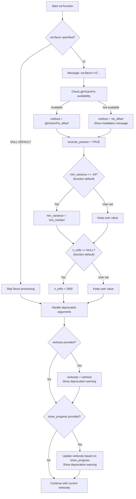

## 2. Method specific Parameter Overrides

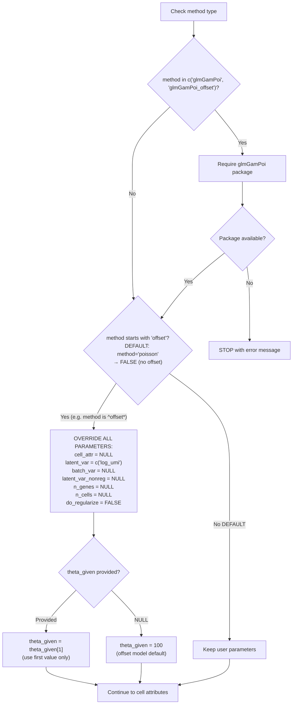

## 3. Cell Attribute Setup and Gene Filtering

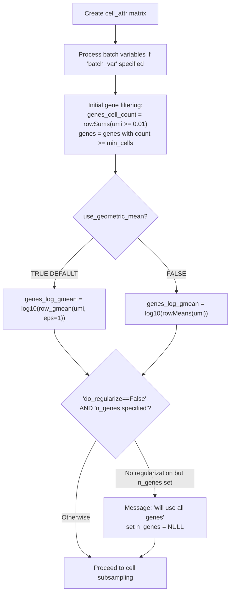

## 4. Cell and Gene Subsampling for Step 1

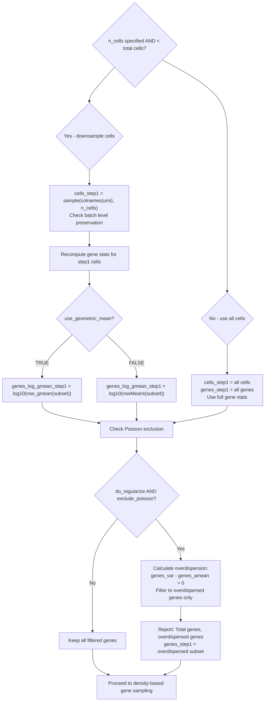

## 5. Density-Based Gene Sampling and Model Formula Construction

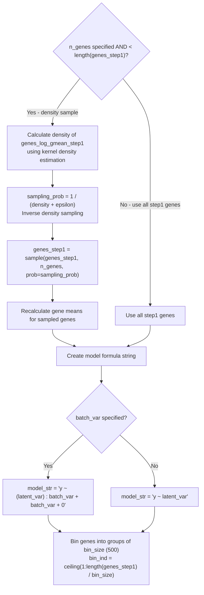

## 6. Model Parameter Estimation

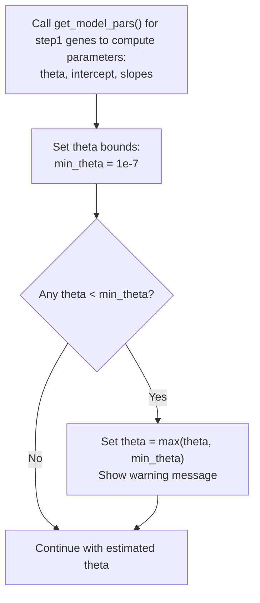
{}
Above we show logic flow at the level of `vst()`, then below we step into the core function `get_model_pars()`
{}

## 6.1 get_model_pars() Parameter Analysis
Here traces all parameters passed to the `get_model_pars()` function within `sctransform::vst()`, documenting their possible values, upstream decision logic, and parameter interactions.

**Function Signature**
```r
model_pars <- get_model_pars(genes_step1, bin_size, umi, model_str, cells_step1,
                             method, data_step1, theta_given, theta_estimation_fun,
                             exclude_poisson, fix_intercept, fix_slope,
                             use_geometric_mean, use_geometric_mean_offset, verbosity)
```

### 1. genes_step1 {#genes-step1}

{}
**Type**: Character vector of gene names  
**Description**: Filtered subset of genes used for model parameter estimation

**Possible Values**: Gene names that pass multiple filtering criteria

**Upstream Decision Tree**:
```r
# Stage 1: Initial filtering by cell count
genes_cell_count <- rowSums(umi >= 0.01)
genes <- rownames(umi)[genes_cell_count >= min_cells]

# Stage 2: Cell downsampling affects gene selection
if (!is.null(n_cells) && n_cells < ncol(umi)) {
    cells_step1 <- sample(x = colnames(umi), size = n_cells)
    genes_cell_count_step1 <- rowSums(umi[, cells_step1] > 0)
    genes_step1 <- rownames(umi)[genes_cell_count_step1 >= min_cells]
} else {
    genes_step1 <- genes
}

# Stage 3: Poisson gene exclusion
if (do_regularize && exclude_poisson) {
    overdispersion_factor_step1 <- overdispersion_factor[genes_step1]
    is_overdispersed <- (overdispersion_factor_step1 > 0)
    genes_step1 <- genes_step1[is_overdispersed]
}

# Stage 4: Density-based gene sampling
if (!is.null(n_genes) && n_genes < length(genes_step1)) {
    log_gmean_dens <- density(x = genes_log_gmean_step1, bw = 'nrd', adjust = 1)
    sampling_prob <- 1 / (approx(...)$y + .Machine$double.eps)
    genes_step1 <- sample(x = genes_step1, size = n_genes, prob = sampling_prob)
}
```
{}

### 2. bin_size {#bin-size}

{}
**Type**: Numeric  
**Default**: 500  
**Description**: Number of genes processed per batch

**Source**: Direct function parameter with no upstream modification
{}

### 3. umi {#umi}

{}
**Type**: Matrix (genes × cells)  
**Description**: UMI count matrix after initial gene filtering

**Upstream Logic**:
```r
genes_cell_count <- rowSums(umi >= 0.01)
genes <- rownames(umi)[genes_cell_count >= min_cells]
umi <- umi[genes, ]  # Filtered to qualifying genes only
```
{}

### 4. model_str {#model-str}

{}
**Type**: Character string (R formula)  
**Description**: Model formula for regression

**Possible Values**:
- **With batch variable**: `"y ~ (latent_var1 + latent_var2 + ...) : batch_var + batch_var + 0"`
- **Without batch**: `"y ~ latent_var1 + latent_var2 + ..."`

**Upstream Logic**:
```r
if (!is.null(batch_var)) {
    model_str <- paste0('y ~ (', paste(latent_var, collapse = ' + '), 
                       ') : ', batch_var, ' + ', batch_var, ' + 0')
} else {
    model_str <- paste0('y ~ ', paste(latent_var, collapse = ' + '))
}
```

{}
Batch variable presence fundamentally changes the model structure and complexity.
{}
{}

### 5. cells_step1 {#cells-step1}

{}
**Type**: Character vector of cell names  
**Description**: Subset of cells used for parameter estimation

**Possible Values**:
- **All cells**: `colnames(umi)` when `n_cells` is NULL or ≥ total cells
- **Downsampled**: Random sample of size `n_cells`

**Upstream Logic**:
```r
if (!is.null(n_cells) && n_cells < ncol(umi)) {
    cells_step1 <- sample(x = colnames(umi), size = n_cells)
    
    # Batch level validation
    if (!is.null(batch_var)) {
        dropped_batch_levels <- setdiff(batch_levels, 
                                       levels(droplevels(cell_attr[cells_step1, batch_var])))
        if (length(dropped_batch_levels) > 0) {
            stop('Dropped batch levels ', dropped_batch_levels, ', set n_cells higher')
        }
    }
} else {
    cells_step1 <- colnames(umi)
}
```
{}

### 6. method {#method}

{}
**Type**: Character string  
**Default**: "poisson"  
**Description**: Statistical method for parameter estimation

**Possible Values**:
- `"poisson"` (default)
- `"nb"` (negative binomial)
- `"nb_theta_given"`
- `"nb_fast"`
- `"glmGamPoi"`
- `"glmGamPoi_offset"`
- `"nb_offset"`
- Any method starting with "offset"

**Decision Tree**:

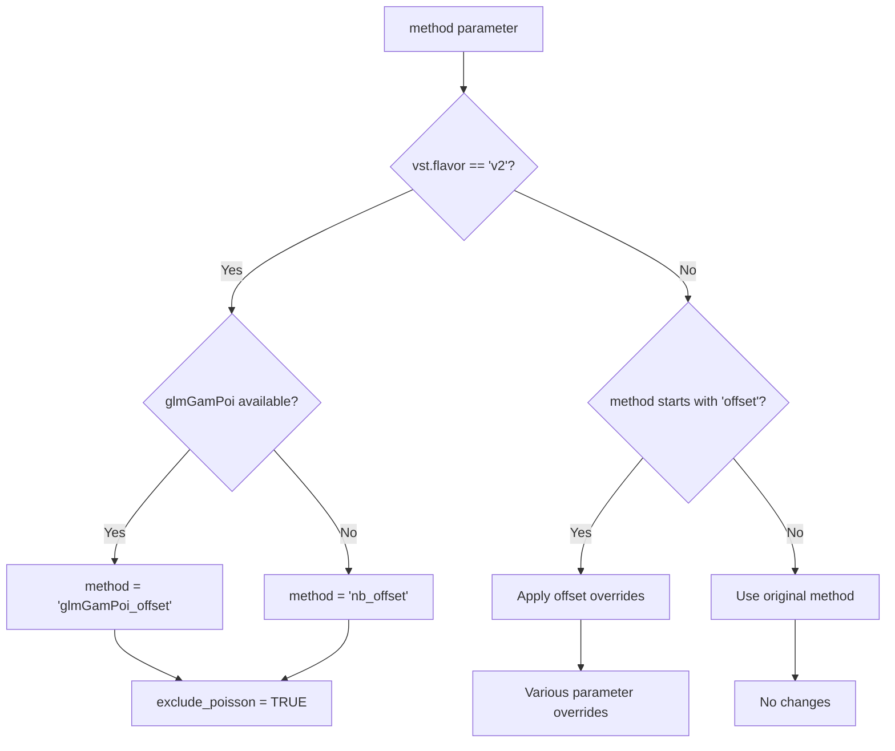

**Upstream Logic**:
```r
# vst.flavor v2 override
if (!is.null(vst.flavor) && vst.flavor == "v2") {
    glmGamPoi_check <- requireNamespace("glmGamPoi", quietly = TRUE)
    method <- "glmGamPoi_offset"
    if (!glmGamPoi_check) {
        method <- "nb_offset"
    }
    exclude_poisson <- TRUE
}

# Offset method special handling
if (startsWith(x = method, prefix = 'offset')) {
    # Multiple parameter overrides occur
}
```
{}

### 7. data_step1 {#data-step1}

{}
**Type**: Data frame  
**Description**: Cell attributes for step1 cells

**Source**: Direct subset of cell_attr
```r
data_step1 <- cell_attr[cells_step1, , drop = FALSE]
```
{}

### 8. theta_given {#theta-given}

{}
**Type**: Numeric or NULL  
**Default**: NULL  
**Description**: Fixed theta parameter for negative binomial distribution

**Possible Values**:
- `NULL` (default) - theta will be estimated
- User-specified numeric value
- `100` (automatically set for offset methods)

**Upstream Logic**:
```r
# Offset method override
if (startsWith(x = method, prefix = 'offset')) {
    if (is.null(theta_given)) {
        theta_given <- 100
    } else {
        theta_given <- theta_given[1]  # Take first element only
    }
}
```
{}

### 9. theta_estimation_fun {#theta-estimation}

{}
**Type**: Character string  
**Default**: "theta.ml"  
**Description**: Function name for theta parameter estimation

**Possible Values**:
- `"theta.ml"` (maximum likelihood)
- `"theta.mm"` (method of moments)
- Other theta estimation functions

**Source**: Direct function parameter
{}

### 10. exclude_poisson {#exclude-poisson}

{}
**Type**: Logical  
**Default**: FALSE  
**Description**: Whether to exclude Poisson-distributed genes from estimation

**Decision Path**:
- **FALSE** (default behavior)
- **TRUE** when `vst.flavor = "v2"`
- User-specified override

**Upstream Logic**:
```r
if (!is.null(vst.flavor) && vst.flavor == "v2") {
    exclude_poisson <- TRUE
}
```

{}
When TRUE, genes with overdispersion factor ≤ 0 are excluded from parameter estimation.
{}
{}

### 11-12. fix_intercept & fix_slope {#fix-parameters}

{}
**Type**: Logical  
**Default**: FALSE  
**Description**: Whether to fix intercept/slope parameters during estimation

**Source**: Direct function parameters with no upstream modification
{}

### 13-14. use_geometric_mean & use_geometric_mean_offset {#geometric-mean}

{}
**Type**: Logical  
**Defaults**: TRUE, FALSE respectively  
**Description**: Control geometric mean usage in calculations

**Source**: Direct function parameters with no upstream modification
{}

### 15. verbosity {#verbosity}

{}
**Type**: Numeric  
**Default**: 2  
**Description**: Level of diagnostic output

**Possible Values**: 0 (silent), 1 (minimal), 2+ (verbose)

**Upstream Logic** (handles deprecated parameters):
```r
# Handle deprecated 'verbose' argument
if (!is.null(verbose)) {
    warning("The 'verbose' argument is deprecated...")
    verbosity <- as.numeric(verbose)
}

# Handle deprecated 'show_progress' argument
if (!is.null(show_progress)) {
    warning("The 'show_progress' argument is deprecated...")
    if (show_progress) {
        verbosity <- 2
    } else {
        verbosity <- min(verbosity, 1)
    }
}
```
{}

## 6.2 get_model_pars() Major Parameter Overwrite

### Set vst.flavor = "v2" {#v2-effects}

When `vst.flavor = "v2"` is specified, multiple parameters are automatically adjusted:

{}
| Parameter | Original | v2 Override |
|-----------|----------|-------------|
| `method` | "poisson" | "glmGamPoi_offset" or "nb_offset" |
| `exclude_poisson` | FALSE | TRUE |
| `min_variance` | -Inf | 'umi_median' |
| `n_cells` | NULL | 2000 |

**Implementation**:
```r
if (vst.flavor == "v2") {
    glmGamPoi_check <- requireNamespace("glmGamPoi", quietly = TRUE)
    method <- "glmGamPoi_offset"
    if (!glmGamPoi_check) {
        method <- "nb_offset"
    }
    exclude_poisson <- TRUE
    if (min_variance == -Inf) min_variance <- 'umi_median'
    if (is.null(n_cells)) n_cells <- 2000
}
```
{}

### Offset Method Effects {#offset-effects}

When `method` starts with "offset", extensive parameter overrides occur:

{}
```r
if (startsWith(x = method, prefix = 'offset')) {
    cell_attr <- NULL
    latent_var <- c('log_umi')
    batch_var <- NULL
    latent_var_nonreg <- NULL
    n_genes <- NULL
    n_cells <- NULL
    do_regularize <- FALSE
    if (is.null(theta_given)) {
        theta_given <- 100
    } else {
        theta_given <- theta_given[1]
    }
}
```

{}
Offset methods fundamentally change the modeling approach and override many user-specified parameters.
{}
{}

## 6.3 get_model_pars() Logic Tree

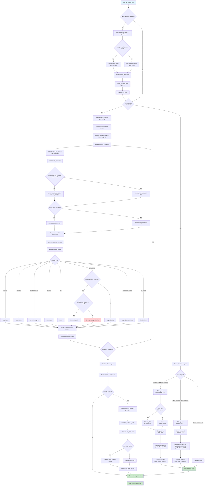
## 6.4 Workflow Position

The `get_model_pars()` call occurs at a specific point in the `vst()` workflow:

1. ✅ Parameter validation and preprocessing
2. ✅ Gene and cell filtering  
3. ✅ Model formula construction
4. **→ get_model_pars() call** ← *We are here*
5. ⏳ Parameter regularization
6. ⏳ Residual calculation
7. ⏳ Output preparation

## 6.5 Key Decision Points

### 1. **`fix_slope | fix_intercept`**
- **Condition**: `fix_slope OR fix_intercept`
- **Action**: Pre-calculate fixed model parameters using gene means and cell sums
- **Options**: Use geometric mean offset or standard arithmetic mean

### 2. **Branch A: Special Methods**
- **Offset Methods**: Handle special cases with shared theta estimation
  - `offset_shared_theta_estimate`: Use top 250 highly expressed genes
  - `offset_allshared_theta_estimate`: Use all genes with detection > 0.5
  - Other offset methods: Use provided theta values

### 3. **Branch B: Standard Processing**
- **Binning**: Divide genes into bins for batch processing
- **Parallel Processing**: Distribute work across available workers
- **Method Selection**: Route to appropriate fitting function based on method parameter
  - `poisson`: Poisson regression
  - `qpoisson`: Quasi-Poisson regression  
  - `nb_theta_given`: Negative binomial with given theta
  - `nb_fast`: Fast negative binomial fitting
  - `nb`: Standard negative binomial
  - `glmGamPoi`: Gamma-Poisson GLM (with version check for fixed parameters)
  - `glmGamPoi_offset`: Offset version of Gamma-Poisson
  - `nb_offset`: Offset negative binomial

### 4. **Branch B: Post-Processing Branch**
- **Condition**: `exclude_poisson`
- **Action**: Filter out genes where theta estimates are unreliable.
- **Rationale is unclear**: 
  - Empirically, genes exhibiting Poisson variation were overwhelmingly lowly expressed compared to genes that were overdispersed.
  - Sctransform_v2 paper says to remove "genes with either very low abundance (μ < 0.001), or where the variance of count values did not exceed the average abundance (i.e., σ 2 ≤ μ), we lacked sufficient information to learn robust NB parameter estimate"
  - `diff_theta <- predicted_theta/actual_theta`
  - predicted_theta is MLE
  - actual_theta is naive (“method‐of‐moments”) estimate, i.e. `genes_amean_step1^2/(genes_var_step1-genes_amean_step1)`
- **Threshold**: Set theta to infinity if `diff_theta < 1e-3`

## 7. Parameter Regularization

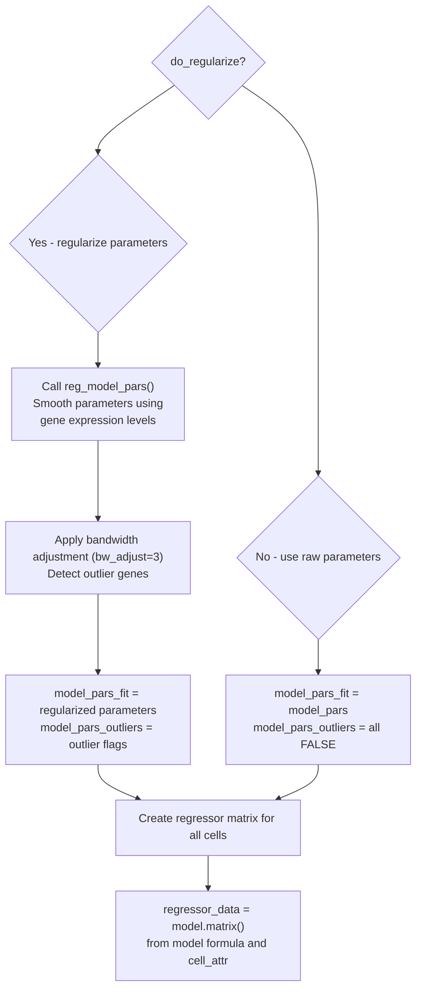
## 7.1 Step into reg_model_pars()
**Signature**
```r
model_pars_fit <- reg_model_pars(model_pars, genes_log_gmean_step1, genes_log_gmean, cell_attr,
                                 batch_var, cells_step1, genes_step1, umi, bw_adjust, gmean_eps,
                                 theta_regularization, genes_amean, genes_var,
                                 exclude_poisson, fix_intercept, fix_slope,
                                 use_geometric_mean, use_geometric_mean_offset, verbosity)
```

### 1. model_pars

{}
- **Source**: Output from `get_model_pars()` function call
- **Upstream Logic**: Result of model parameter estimation on step 1 genes/cells
- **Type**: Matrix containing model parameters including theta values
- **Dependencies**: Calculated using `genes_step1`, `umi`, `model_str`, `cells_step1`
- **Content**: Contains fitted regression coefficients and theta dispersion parameters
{}

### 2. genes_log_gmean_step1

{}
- **Source**: Calculated in step 1 gene selection logic
- **Upstream Logic**:
  ```r
  if (use_geometric_mean){
    genes_log_gmean_step1 <- log10(row_gmean(umi[genes_step1, ], eps = gmean_eps))
  } else {
    genes_log_gmean_step1 <- log10(rowMeans(umi[genes_step1, ]))
  }
  ```
- **Possible Values**: Log10 of geometric mean or arithmetic mean of UMI counts for step 1 genes
- **Dependencies**: `use_geometric_mean`, `genes_step1`, `gmean_eps`
- **Purpose**: Used for regularization fitting on the subset of genes used in step 1
{}

### 3. genes_log_gmean

{}
- **Source**: Calculated early in function for all qualifying genes
- **Upstream Logic**:
  ```r
  if (use_geometric_mean){
    genes_log_gmean <- log10(row_gmean(umi, eps = gmean_eps))
  } else {
    genes_log_gmean <- log10(rowMeans(umi))
  }
  ```
- **Possible Values**: Log10 of geometric mean or arithmetic mean of UMI counts for all genes
- **Dependencies**: `use_geometric_mean`, `gmean_eps`
- **Purpose**: Target values for regularization - parameters will be predicted for all these genes
{}

### 4. cell_attr

{}
- **Source**: Output from `make_cell_attr()` function
- **Upstream Logic**: 
  ```r
  cell_attr <- make_cell_attr(umi, cell_attr, latent_var, batch_var, latent_var_nonreg, verbosity)
  ```
- **Additional Processing**: If `batch_var` is not NULL, it's converted to factor:
  ```r
  if (!is.null(batch_var)) {
    cell_attr[, batch_var] <- as.factor(cell_attr[, batch_var])
    batch_levels <- levels(cell_attr[, batch_var])
  }
  ```
- **Possible Values**: Data frame with cell attributes including latent variables and batch information
- **Content**: Contains log_umi, batch variables, and other cell-level covariates
{}

### 5. batch_var

{}
- **Source**: Direct parameter from function signature
- **Default**: `NULL`
- **Possible Values**: `NULL` or character string specifying batch variable name
- **Impact**: Affects model formula construction and cell attribute processing
- **Usage**: Used to identify batch effects that need to be accounted for in regularization
{}

### 6. cells_step1

{}
- **Source**: Either sampled subset or all cells
- **Upstream Logic**:
  ```r
  if (!is.null(n_cells) && n_cells < ncol(umi)) {
    cells_step1 <- sample(x = colnames(umi), size = n_cells)
    # ... validation logic for batch levels ...
  } else {
    cells_step1 <- colnames(umi)
  }
  ```
- **Possible Values**: Character vector of cell names (subset or all)
- **Purpose**: Defines which cells were used for initial parameter estimation
{}

### 7. genes_step1

{}
- **Source**: Filtered and potentially sampled gene set
- **Complex Upstream Logic**:
  1. **Initial Filter**: Start with genes passing `min_cells` threshold
  2. **Overdispersion Filter** (if `exclude_poisson = TRUE` and `do_regularize = TRUE`):
     ```r
     overdispersion_factor_step1 <- overdispersion_factor[genes_step1]
     is_overdispersed <- (overdispersion_factor_step1 > 0)
     genes_step1 <- genes_step1[is_overdispersed]
     ```
  3. **Density Sampling** (if `n_genes` specified and smaller than available genes):
     ```r
     log_gmean_dens <- density(x = genes_log_gmean_step1, bw = 'nrd', adjust = 1)
     sampling_prob <- 1 / (approx(x = log_gmean_dens$x, y = log_gmean_dens$y, 
                                  xout = genes_log_gmean_step1)$y + .Machine$double.eps)
     genes_step1 <- sample(x = genes_step1, size = n_genes, prob = sampling_prob)
     ```
- **Possible Values**: Character vector of gene names
- **Purpose**: Defines which genes were used for initial parameter estimation
{}

### 8. umi

{}
- **Source**: Direct parameter, filtered to qualifying genes
- **Upstream Logic**: `umi <- umi[genes, ]` where `genes` are those detected in ≥ `min_cells` cells
- **Possible Values**: Sparse or dense matrix of UMI counts
- **Processing**: Pre-filtered to remove genes with insufficient cell detection
- **Format**: Genes as rows, cells as columns
{}

### 9. bw_adjust

{}
- **Source**: Direct parameter from function signature
- **Default**: `3`
- **Possible Values**: Numeric value for bandwidth adjustment in regularization
- **Purpose**: Controls smoothing in regularization process - higher values = more smoothing
- **Usage**: Applied to kernel density estimation in regularization fitting
{}

### 10. gmean_eps

{}
- **Source**: Direct parameter from function signature
- **Default**: `1`
- **Possible Values**: Numeric epsilon value for geometric mean calculation
- **Purpose**: Prevents log(0) in geometric mean calculations by adding small constant
- **Impact**: Only relevant when `use_geometric_mean = TRUE`
{}

### 11. theta_regularization

{}
- **Source**: Direct parameter from function signature
- **Default**: `'od_factor'`
- **Possible Values**: Character string specifying theta regularization method
- **Purpose**: Determines how theta (dispersion) parameters are regularized across genes
- **Options**: Typically 'od_factor' (overdispersion factor based) or other method strings
{}

### 12. genes_amean

{}
- **Source**: Calculated conditionally for Poisson gene exclusion
- **Upstream Logic**:
  ```r
  if (do_regularize && exclude_poisson){
    genes_amean <- rowMeans(umi)
    genes_var <- row_var(umi)
    overdispersion_factor <- genes_var - genes_amean
    # ... used for filtering overdispersed genes ...
  }
  ```
- **Possible Values**: `NULL` or numeric vector of gene arithmetic means
- **Dependencies**: `do_regularize`, `exclude_poisson`
- **Purpose**: Used with variance to identify overdispersed (non-Poisson) genes
{}

### 13. genes_var

{}
- **Source**: Calculated conditionally for Poisson gene exclusion
- **Upstream Logic**: Same as `genes_amean` - calculated together for overdispersion analysis
- **Possible Values**: `NULL` or numeric vector of gene variances
- **Purpose**: Used with `genes_amean` to identify overdispersed genes (variance > mean)
- **Formula**: `overdispersion_factor = genes_var - genes_amean`
{}

### 14. exclude_poisson

{}
- **Source**: Direct parameter, modified by `vst.flavor`
- **Default**: `FALSE`
- **Upstream Logic**: Set to `TRUE` when `vst.flavor == "v2"`
- **Possible Values**: `TRUE` or `FALSE`
{}

### 15. fix_intercept

{}
- **Source**: Direct parameter from function signature
- **Default**: `FALSE`
- **Possible Values**: `TRUE` or `FALSE`
- **Purpose**: Controls whether model intercept is fixed during fitting
- **Usage**: When `TRUE`, intercept parameters are not regularized/smoothed
{}

### 16. fix_slope

{}
- **Source**: Direct parameter from function signature
- **Default**: `FALSE`
- **Possible Values**: `TRUE` or `FALSE`
- **Purpose**: Controls whether model slope is fixed during fitting
- **Usage**: When `TRUE`, slope parameters are not regularized/smoothed
{}

### 17. use_geometric_mean

{}
- **Source**: Direct parameter from function signature
- **Default**: `TRUE`
- **Possible Values**: `TRUE` or `FALSE`
- **Impact**: 
  - Affects calculation of `genes_log_gmean` and `genes_log_gmean_step1`
  - When `TRUE`: uses `row_gmean()` function
  - When `FALSE`: uses `rowMeans()` (arithmetic mean)
{}

### 18. use_geometric_mean_offset

{}
- **Source**: Direct parameter from function signature
- **Default**: `FALSE`
- **Possible Values**: `TRUE` or `FALSE`
- **Purpose**: Controls offset usage in geometric mean calculations
- **Usage**: Affects how geometric means are incorporated into model fitting
{}

### 19. verbosity

{}
- **Source**: Direct parameter, potentially modified by deprecated arguments
- **Default**: `2`
- **Upstream Logic**: 
  - Modified by deprecated `verbose` parameter
  - Modified by deprecated `show_progress` parameter
- **Possible Values**: Integer indicating verbosity level (0, 1, 2+)
- **Purpose**: Controls amount of progress/debug information displayed during regularization
{}

### Critical Conditional Logic

{}
When `vst.flavor == "v2"`:
- `exclude_poisson` is set to `TRUE`
- `min_variance` defaults to `'umi_median'` if not specified
- `n_cells` defaults to `2000` if not specified
- Method switches to `"glmGamPoi_offset"` or `"nb_offset"`
- Message displayed: "vst.flavor='v2' set. Using model with fixed slope and excluding poisson genes."

When method starts with 'offset':
- `do_regularize` is set to `FALSE`
- Therefore `reg_model_pars()` is **never called**
- Multiple parameters are overridden including:
  - `cell_attr = NULL`
  - `latent_var = c('log_umi')`
  - `batch_var = NULL`
  - `latent_var_nonreg = NULL`
  - `n_genes = NULL`
  - `n_cells = NULL`
  - `theta_given = 100` (default)
{}

## 7.2 reg_model_pars() Logic Tree

```mermaid
flowchart TD
    A["Start: reg_model_pars"] --> B{"batch_var is set?"}
    
    B -->|"Yes"| C["exclude_poisson = FALSE<br/>fix_slope = FALSE"]
    B -->|"No"| D{"exclude_poisson OR<br/>fix_slope OR<br/>fix_intercept?"}
    
    C --> D
    
    D -->|"Yes"| E["Calculate gene statistics if they're null:<br/>genes_amean, genes_var"]
    D -->|"No"| F["Skip Poisson handling"]
    
    E --> G["Calculate overdispersion_factor<br/>= genes_var - genes_amean"]
    G --> H["Identify 'Poisson' genes satisfying<br/>overdispersion ≤ 0"]
    H --> I["Add to 'Poisson' genes <br/> if satisfying mean < 1e-3"]
    I --> IA["Get 'Poisson' genes in step 1 to compare"]
    I --> J["Create vst_out_offset<br/>for Poisson genes<br/>theta = Inf"]
    
    J --> K["Transform theta to<br/>dispersion parameter"]
    F --> K
    
    K --> L{"theta_regularization?"}
    L -->|"log_theta"| M["dispersion_par = log10(theta)"]
    L -->|"od_factor"| N["dispersion_par = log10(1 + gmean/theta)"]
    
    M --> O["Find outliers in parameters"]
    N --> O
    
    O --> P["Remove outliers from fitting"]
    
    P --> Q{"exclude_poisson?"}
    Q -->|"Yes"| R["Remove Poisson genes<br/>from model_pars"]
    Q -->|"No"| S["Keep all genes"]
    
    R --> T["Calculate bandwidth<br/>bw = bw.SJ × bw_adjust"]
    S --> T
    
    T --> U["Prepare x_points for<br/>parameter smoothing"]
    
    U --> V{"batch_var exists?"}
    
    V -->|"No"| W["Global regularization<br/>Use ksmooth for all parameters"]
    V -->|"Yes"| X["Batch-specific regularization"]
    
    X --> Y["For each batch:"]
    Y --> Z["Calculate batch-specific<br/>gene means"]
    Z --> AA["Apply ksmooth per batch<br/>for batch parameters"]
    
    W --> BB["Back-transform dispersion<br/>parameter to theta"]
    AA --> BB
    
    BB --> CC{"theta_regularization?"}
    CC -->|"log_theta"| DD["theta = 10^dispersion_par"]
    CC -->|"od_factor"| EE["theta = gmean/(10^dispersion_par - 1)"]
    
    DD --> FF{"exclude_poisson?"}
    EE --> FF
    
    FF -->|"Yes"| GG["Replace Poisson gene<br/>parameters with offset values"]
    FF -->|"No"| HH["Keep regularized parameters"]
    
    GG --> II{"fix_intercept?"}
    HH --> II
    
    II -->|"Yes"| JJ["Replace intercepts<br/>with offset calculation"]
    II -->|"No"| KK{"fix_slope?"}
    
    JJ --> KK
    
    KK -->|"Yes"| LL["Replace log_umi slope<br/>with log(10)"]
    KK -->|"No"| MM["Return final<br/>model_pars_fit"]
    
    LL --> MM
    
    MM["End: Return regularized<br/>parameters with outliers<br/>attribute"]

    %% Styling
    classDef startEnd fill:#e1f5fe,stroke:#0277bd,stroke-width:2px
    classDef decision fill:#fff3e0,stroke:#f57c00,stroke-width:2px
    classDef process fill:#f3e5f5,stroke:#7b1fa2,stroke-width:2px
    classDef calculation fill:#e8f5e8,stroke:#2e7d32,stroke-width:2px
    
    class A,MM startEnd
    class B,D,L,Q,V,CC,FF,II,KK decision
    class C,E,G,H,I,J,P,R,S,T,U,W,X,Y,Z,AA,GG,HH,JJ,LL process
    class M,N,O,BB,DD,EE calculation
```

## 7.3 Key decision points
### 1. **Batch Variable Handling**
- If `batch_var` is set → Force `exclude_poisson = FALSE` and `fix_slope = FALSE`
- Enables batch-specific parameter regularization

### 2. **Theta Regularization Strategy**
- **log_theta**: Direct log10 transformation of theta
- **od_factor**: Transform to overdispersion factor log10(1 + μ/θ)

### 3. **Parameter Regularization Approach**
- **Global**: Single smoothing across all genes (no batch variable)
- **Batch-specific**: Separate smoothing per batch level

### 4. **Parameter Fixing Options**
- **fix_intercept**: Replace with offset-calculated intercepts
- **fix_slope**: Set log_umi coefficient to log(10)

## 8. Non-Regularized Variable Processing

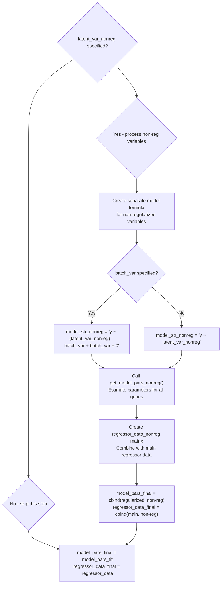
## 8.1 Step into get_model_pars_nonreg()

```r
model_pars_nonreg <- get_model_pars_nonreg(genes, bin_size, model_pars_fit, regressor_data, umi, model_str_nonreg, cell_attr, verbosity)
```

### 1. genes

{}
**Value**: Vector of gene names that meet minimum cell count threshold

**Upstream Logic**:
```r
# Initial filtering based on minimum cells
genes_cell_count <- rowSums(umi >= 0.01)
genes <- rownames(umi)[genes_cell_count >= min_cells]
umi <- umi[genes, ]
```

- **Source**: Filtered from original UMI matrix rownames
- **Filtering**: Genes detected in at least `min_cells` cells (default: 5)
- **Type**: Character vector of gene identifiers
{}

### 2. bin_size

{}
**Value**: Number of genes processed per batch

**Upstream Logic**:
```r
# Direct parameter from function arguments
bin_size = 500  # default value
```

- **Source**: Function parameter with default value 500
- **Purpose**: Controls batch processing size for computational efficiency
- **Type**: Integer
{}

### 3. model_pars_fit

{}
**Value**: Fitted/regularized model parameters from step 1

**Upstream Logic**:
```r
# First get raw model parameters
model_pars <- get_model_pars(genes_step1, bin_size, umi, model_str, cells_step1,
                            method, data_step1, theta_given, theta_estimation_fun,
                            exclude_poisson, fix_intercept, fix_slope,
                            use_geometric_mean, use_geometric_mean_offset, verbosity)

# Then regularize if do_regularize=TRUE
if (do_regularize) {
    model_pars_fit <- reg_model_pars(model_pars, genes_log_gmean_step1, genes_log_gmean, cell_attr,
                                   batch_var, cells_step1, genes_step1, umi, bw_adjust, gmean_eps,
                                   theta_regularization, genes_amean, genes_var,
                                   exclude_poisson, fix_intercept, fix_slope,
                                   use_geometric_mean, use_geometric_mean_offset, verbosity)
} else {
    model_pars_fit <- model_pars
}
```

- **Source**: Either regularized parameters (if `do_regularize=TRUE`) or raw parameters
- **Contains**: Model coefficients and theta parameters for regularized variables
- **Type**: Matrix with gene rows and parameter columns
{}

### 4. regressor_data

{}
**Value**: Design matrix for regularized variables

**Upstream Logic**:
```r
# Built from model formula for regularized variables
regressor_data <- model.matrix(as.formula(gsub('^y', '', model_str)), cell_attr)

# Where model_str is constructed as:
if (!is.null(batch_var)) {
    model_str <- paste0('y ~ (', paste(latent_var, collapse = ' + '), ') : ', batch_var, ' + ', batch_var, ' + 0')
} else {
    model_str <- paste0('y ~ ', paste(latent_var, collapse = ' + '))
}
```

- **Source**: Design matrix from regularized model formula
- **Variables**: Includes `latent_var` (default: 'log_umi') and `batch_var` if specified
- **Type**: Matrix with cells as rows, model terms as columns
{}

### 5. umi

{}
**Value**: Filtered UMI count matrix

**Upstream Logic**:
```r
# Original UMI matrix filtered to genes meeting min_cells threshold
genes_cell_count <- rowSums(umi >= 0.01)
genes <- rownames(umi)[genes_cell_count >= min_cells]
umi <- umi[genes, ]
```

- **Source**: Input UMI matrix filtered by gene detection
- **Filtering**: Only genes detected in ≥ `min_cells` cells
- **Type**: Matrix/sparse matrix with genes as rows, cells as columns
{}

### 6. model_str_nonreg

{}
**Value**: Model formula string for non-regularized variables

**Upstream Logic**:
```r
if (!is.null(latent_var_nonreg)) {
    if (!is.null(batch_var)) {
        model_str_nonreg <- paste0('y ~ (', paste(latent_var_nonreg, collapse = ' + '), ') : ', batch_var, ' + ', batch_var, ' + 0')
    } else {
        model_str_nonreg <- paste0('y ~ ', paste(latent_var_nonreg, collapse = ' + '))
    }
} else {
    model_str_nonreg <- ''
}
```

- **Source**: Constructed from `latent_var_nonreg` parameter
- **Condition**: Only created if `latent_var_nonreg` is not NULL
- **Format**: Similar to main model but uses non-regularized variables
- **Type**: Character string
{}

### 7. cell_attr

{}
**Value**: Cell attribute data frame with covariates

**Upstream Logic**:
```r
cell_attr <- make_cell_attr(umi, cell_attr, latent_var, batch_var, latent_var_nonreg, verbosity)

# Additional processing for batch variables:
if (!is.null(batch_var)) {
    cell_attr[, batch_var] <- as.factor(cell_attr[, batch_var])
    batch_levels <- levels(cell_attr[, batch_var])
}
```

- **Source**: Created/augmented by `make_cell_attr()` function
- **Contains**: All covariates including `latent_var`, `batch_var`, and `latent_var_nonreg`
- **Processing**: Batch variables converted to factors
- **Type**: Data frame with cells as rows, attributes as columns
{}

### 8. verbosity

{}
**Value**: Verbosity level for progress messages

**Upstream Logic**:
```r
# Direct parameter with backwards compatibility handling
verbosity = 2  # default

# Backwards compatibility:
if (!is.null(verbose)) {
    warning("The 'verbose' argument is deprecated as of v0.3. Use 'verbosity' instead.")
    verbosity <- as.numeric(verbose)
}
if (!is.null(show_progress)) {
    warning("The 'show_progress' argument is deprecated as of v0.3. Use 'verbosity' instead.")
    if (show_progress) {
        verbosity <- 2
    } else {
        verbosity <- min(verbosity, 1)
    }
}
```

- **Source**: Function parameter with default value 2
- **Range**: Typically 0 (silent), 1 (minimal), 2 (detailed)
- **Type**: Integer
{}

### 9. Key Conditions

{}
The `get_model_pars_nonreg()` function is only called when:
```r
if (!is.null(latent_var_nonreg)) {
    # Function call happens here
}
```

**Triggering Condition**: `latent_var_nonreg` parameter must be specified (not NULL)
**Purpose**: Estimate parameters for variables that should not be regularized
**Default**: `latent_var_nonreg = NULL`, so this step is skipped by default
{}

### 10. Summary

{}

| Parameter | Source Type | Default/Typical Value |
|-----------|-------------|----------------------|
| `genes` | Filtered from input | Gene names passing min_cells filter |
| `bin_size` | Function parameter | 500 |
| `model_pars_fit` | Computed | Matrix from regularization step |
| `regressor_data` | Computed | Design matrix from model_str |
| `umi` | Filtered input | Count matrix |
| `model_str_nonreg` | Constructed | Formula string or empty |
| `cell_attr` | Processed input | Data frame with covariates |
| `verbosity` | Function parameter | 2 |

The trace shows that `get_model_pars_nonreg()` receives 8 parameters, with their values determined by various upstream processing steps in the `vst()` function. The key insight is that this function is only called when `latent_var_nonreg` is specified, which allows users to include additional covariates that should be estimated but not regularized (like the main `latent_var` parameters are).

{}
## 8.2 get_model_pars_nonreg() logic tree
```mermaid
graph TD
    A["Start: get_model_pars_nonreg"] --> B["Calculate bin_ind = ceiling(1:length(genes) / bin_size)"]
    B --> C["Set max_bin = max(bin_ind)"]
    C --> D{"verbosity > 1?"}
    
    D -->|Yes| E["Initialize progress bar pb"]
    D -->|No| F["Skip progress bar setup"]
    
    E --> G["Initialize empty model_pars_nonreg list"]
    F --> G
    
    G --> H["Start loop: i = 1 to max_bin"]
    H --> I["Get genes_bin = genes where bin_ind == i"]
    I --> J["Calculate mu = tcrossprod of model_pars_fit and regressor_data"]
    J --> K["Extract umi_bin matrix for current genes"]
    K --> L{"nbrOfWorkers() == 1?"}
    
    L -->|Yes| M["Set my.lapply = lapply"]
    L -->|No| N["Set my.lapply = future_lapply"]
    
    M --> O["Apply my.lapply to genes_bin"]
    N --> O
    
    O --> P["For each gene in genes_bin:"]
    P --> Q["Create negative binomial family with theta from model_pars_fit"]
    Q --> R["Set y = umi counts for current gene"]
    R --> S["Set offs = mu values for current gene"]
    S --> T["Fit GLM with model_str_nonreg formula"]
    T --> U["Return fit coefficients"]
    
    U --> V["Combine all gene results with rbind"]
    V --> W["Store results in model_pars_nonreg list at index i"]
    W --> X{"verbosity > 1?"}
    
    X -->|Yes| Y["Update progress bar"]
    X -->|No| Z["Skip progress bar update"]
    
    Y --> AA{"i < max_bin?"}
    Z --> AA
    AA -->|Yes| AB["Increment i, continue loop"]
    AA -->|No| AC["Exit loop"]
    
    AB --> I
    AC --> AD{"verbosity > 1?"}
    
    AD -->|Yes| AE["Close progress bar"]
    AD -->|No| AF["Skip progress bar cleanup"]
    
    AE --> AG["Combine all bins with do.call rbind"]
    AF --> AG
    AG --> AH["Set rownames to genes"]
    AH --> AI["Return model_pars_nonreg matrix"]
    AI --> AJ["End"]

    classDef startEnd fill:#e1f5fe,stroke:#01579b
    classDef process fill:#f3e5f5,stroke:#4a148c
    classDef decision fill:#fff3e0,stroke:#e65100
    classDef endNode fill:#c8e6c9,stroke:#1b5e20

    class A startEnd
    class AJ endNode
    class D,L,X,AA,AD decision
    class B,C,E,F,G,H,I,J,K,M,N,O,P,Q,R,S,T,U,V,W,Y,Z,AB,AC,AE,AF,AG,AH,AI process

```

## 8.3 Key notes
These non-regularized (no kernal smooth) latent variables are fitted by 
- fixing the theta to be the same as returned from `model_pars_fit` (regularized fit) 
- using the mu returned from `model_pars_fit` (regularized fit) as 'offset' where the optimization starts.

## 9. Residual Calculation

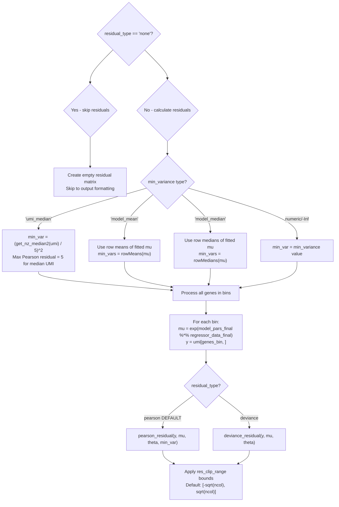

## 10. Final Output Assembly

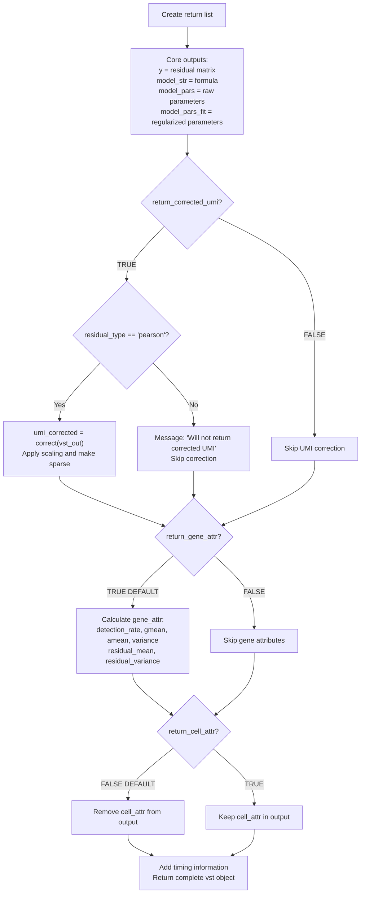


